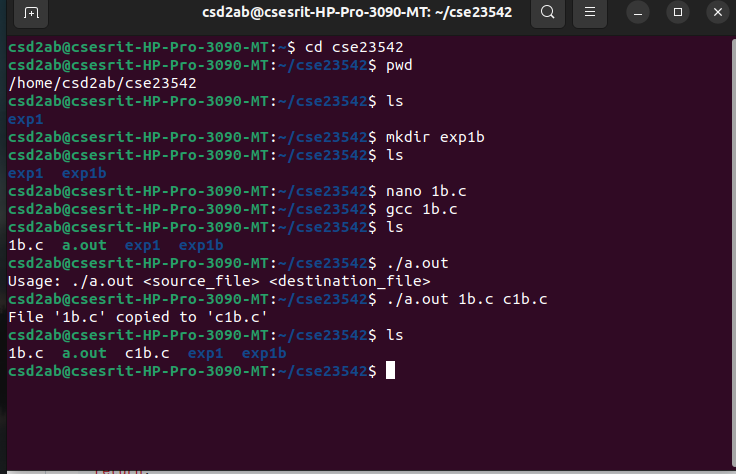
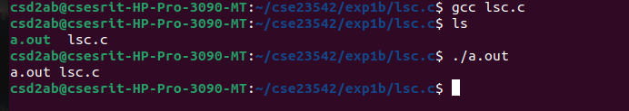
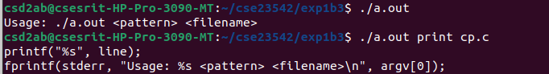
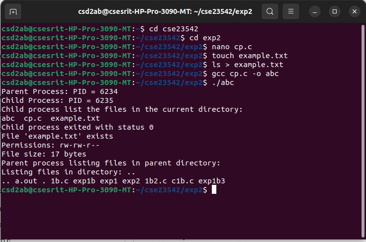

# os_lab
> ## Simulate UNIX commands like cp, ls, grep, etc
``` c
#include <stdio.h>
#include <stdlib.h>
void simulate_cp(const char *source, const char *destination) {
FILE *src = fopen(source, "r");
FILE *dest = fopen(destination, "w");
if (!src || !dest) {
perror(!src ? "Error opening source file" : "Error opening destination file");
if (src) fclose(src);
return;
}
char buffer[1024];
size_t bytes;
while ((bytes = fread(buffer, 1, sizeof(buffer), src)) > 0) {
fwrite(buffer, 1, bytes, dest);
}
printf("File '%s' copied to '%s'\n", source, destination);
fclose(src);
fclose(dest);
}
int main(int argc, char *argv[]) {
if (argc != 3) {
fprintf(stderr, "Usage: %s <source_file> <destination_file>\n", argv[0]);
return EXIT_FAILURE;
}
simulate_cp(argv[1], argv[2]);
return EXIT_SUCCESS;
}
```

> ## Simulation code for ls command
``` c
#include <stdio.h>
#include <stdlib.h>
#include <dirent.h>
void simulate_ls(const char *path) {
struct dirent *entry;
DIR *dir = opendir(path);
if (!dir) {
perror("Error opening directory");
return;
}
while ((entry = readdir(dir)) != NULL) {
if (entry->d_name[0] != '.') {
printf("%s ", entry->d_name);
}
}
printf("\n");
closedir(dir);
}int main(int argc, char *argv[]) {
const char *path = argc > 1 ? argv[1] : ".";
simulate_ls(path);
return 0;
}
```

> ## Simulate Grep command
``` c
#include <stdio.h>
#include <stdlib.h>
#include <string.h>
void simulate_grep(const char *pattern, const char *filename) {
FILE *file = fopen(filename, "r");
if (!file) {
perror("Error opening file");
return;
}
char line[1024];
while (fgets(line, sizeof(line), file)) {
if (strstr(line, pattern)) { // Check if pattern exists in the line
printf("%s", line);
}
}
fclose(file);
}int main(int argc, char *argv[]) {
if (argc != 3) {
fprintf(stderr, "Usage: %s <pattern> <filename>\n", argv[0]);
return EXIT_FAILURE;
}
simulate_grep(argv[1], argv[2]);
return EXIT_SUCCESS;
}
```

> ## To implement UNIX operating system calls fork, exec, getpid, exit, wait, close, stat, opendir and readdir
``` c
#include <stdio.h>
#include <stdlib.h>
#include <sys/types.h>
#include <sys/wait.h>
#include <sys/stat.h>
#include <unistd.h>
#include <dirent.h>
#include <fcntl.h>

void print_permissions(mode_t mode) {
    char perms[10];

    // User permissions
    perms[0] = (mode & S_IRUSR) ? 'r' : '-';
    perms[1] = (mode & S_IWUSR) ? 'w' : '-';
    perms[2] = (mode & S_IXUSR) ? 'x' : '-';

    // Group permissions
    perms[3] = (mode & S_IRGRP) ? 'r' : '-';
    perms[4] = (mode & S_IWGRP) ? 'w' : '-';
    perms[5] = (mode & S_IXGRP) ? 'x' : '-';

    // Other permissions
    perms[6] = (mode & S_IROTH) ? 'r' : '-';
    perms[7] = (mode & S_IWOTH) ? 'w' : '-';
    perms[8] = (mode & S_IXOTH) ? 'x' : '-';

    perms[9] = '\0';  // Null-terminate the string

    printf("Permissions: %s\n", perms);
}

void list_directory(const char *path) {
    DIR *dir = opendir(path);
    struct dirent *entry;
    
    if (dir == NULL) {
        perror("opendir");
        return;
    }

    printf("Listing files in directory: %s\n", path);
    while ((entry = readdir(dir)) != NULL) {
        printf("%s ", entry->d_name);
    }
    printf("\n");

    closedir(dir);
}

int main() {
    pid_t pid;
    int status;
    struct stat file_info;

    // Using fork to create a new child process
    pid = fork();
    if (pid < 0) {
        perror("fork failed");
        exit(1);
    }

    if (pid == 0) {  // Child process
        printf("Child Process: PID = %d\n", getpid());
	printf("Child process list the files in the current directory:\n");
        // Using exec to replace the process image
        execlp("/bin/ls", "ls", NULL);  // List files in the current directory
        perror("exec failed");  // If exec fails
        exit(1);
    } else {  // Parent process
        printf("Parent Process: PID = %d\n", getpid());
        
        // Wait for the child process to finish
        wait(&status);
        if (WIFEXITED(status)) {
            printf("Child process exited with status %d\n", WEXITSTATUS(status));
        }

        // Using stat to get information about a file
        if (stat("example.txt", &file_info) == 0) {
            printf("File 'example.txt' exists\n");
            print_permissions(file_info.st_mode);  // Print human-readable permissions
            printf("File size: %ld bytes\n", file_info.st_size);
        } else {
            perror("stat failed");
        }

        // Using opendir and readdir to list files in a directory
	printf("Parent process listing files in parent directory:\n");
        list_directory("..");

        // Demonstrating file operations with open, write, and close
        int fd = open("testfile.txt", O_WRONLY | O_CREAT, 0644);
        if (fd == -1) {
            perror("open failed");
            exit(1);
        }
        
        write(fd, "Hello, this is a test file!\n", 26);
        close(fd);  // Closing the file

        // Exit the parent process
        exit(0);
    }
}
```

> ## To implement UNIX operating system calls fork, exec, getpid, exit, wait, close, stat, opendir and readdir
``` c
#include <stdio.h>
#include <stdlib.h>
#include <sys/types.h>
#include <sys/wait.h>
#include <sys/stat.h>
#include <unistd.h>
#include <dirent.h>
#include <fcntl.h>

void print_permissions(mode_t mode) {
    char perms[10];

    // User permissions
    perms[0] = (mode & S_IRUSR) ? 'r' : '-';
    perms[1] = (mode & S_IWUSR) ? 'w' : '-';
    perms[2] = (mode & S_IXUSR) ? 'x' : '-';

    // Group permissions
    perms[3] = (mode & S_IRGRP) ? 'r' : '-';
    perms[4] = (mode & S_IWGRP) ? 'w' : '-';
    perms[5] = (mode & S_IXGRP) ? 'x' : '-';

    // Other permissions
    perms[6] = (mode & S_IROTH) ? 'r' : '-';
    perms[7] = (mode & S_IWOTH) ? 'w' : '-';
    perms[8] = (mode & S_IXOTH) ? 'x' : '-';

    perms[9] = '\0';  // Null-terminate the string

    printf("Permissions: %s\n", perms);
}

void list_directory(const char *path) {
    DIR *dir = opendir(path);
    struct dirent *entry;
    
    if (dir == NULL) {
        perror("opendir");
        return;
    }

    printf("Listing files in directory: %s\n", path);
    while ((entry = readdir(dir)) != NULL) {
        printf("%s ", entry->d_name);
    }
    printf("\n");

    closedir(dir);
}

int main() {
    pid_t pid;
    int status;
    struct stat file_info;

    // Using fork to create a new child process
    pid = fork();
    if (pid < 0) {
        perror("fork failed");
        exit(1);
    }

    if (pid == 0) {  // Child process
        printf("Child Process: PID = %d\n", getpid());
	printf("Child process list the files in the current directory:\n");
        // Using exec to replace the process image
        execlp("/bin/ls", "ls", NULL);  // List files in the current directory
        perror("exec failed");  // If exec fails
        exit(1);
    } else {  // Parent process
        printf("Parent Process: PID = %d\n", getpid());
        
        // Wait for the child process to finish
        wait(&status);
        if (WIFEXITED(status)) {
            printf("Child process exited with status %d\n", WEXITSTATUS(status));
        }

        // Using stat to get information about a file
        if (stat("example.txt", &file_info) == 0) {
            printf("File 'example.txt' exists\n");
            print_permissions(file_info.st_mode);  // Print human-readable permissions
            printf("File size: %ld bytes\n", file_info.st_size);
        } else {
            perror("stat failed");
        }

        // Using opendir and readdir to list files in a directory
	printf("Parent process listing files in parent directory:\n");
        list_directory("..");

        // Demonstrating file operations with open, write, and close
        int fd = open("testfile.txt", O_WRONLY | O_CREAT, 0644);
        if (fd == -1) {
            perror("open failed");
            exit(1);
        }
        
        write(fd, "Hello, this is a test file!\n", 26);
        close(fd);  // Closing the file

        // Exit the parent process
        exit(0);
    }
}
```
