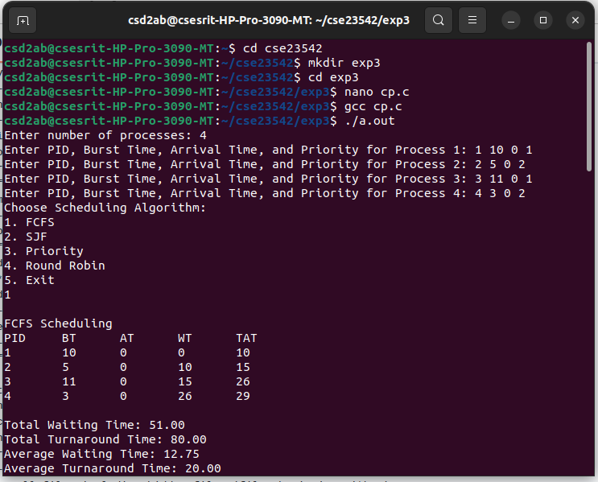
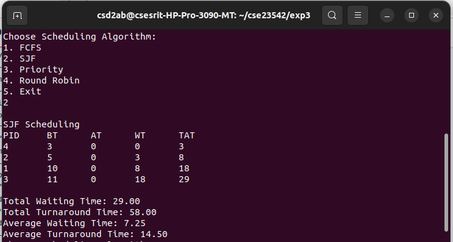
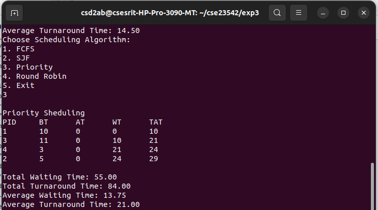
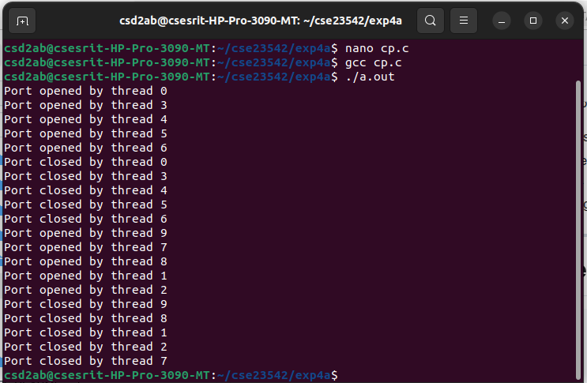
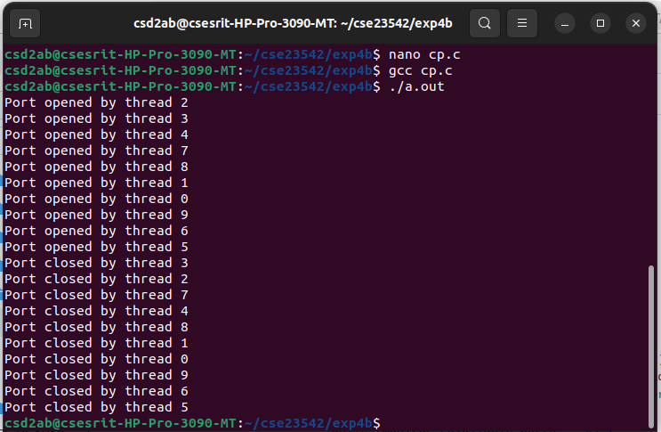

# os_lab
> ## Simulate UNIX commands like cp, ls, grep, etc
``` c
#include <stdio.h>
#include <stdlib.h>
void simulate_cp(const char *source, const char *destination) {
FILE *src = fopen(source, "r");
FILE *dest = fopen(destination, "w");
if (!src || !dest) {
perror(!src ? "Error opening source file" : "Error opening destination file");
if (src) fclose(src);
return;
}
char buffer[1024];
size_t bytes;
while ((bytes = fread(buffer, 1, sizeof(buffer), src)) > 0) {
fwrite(buffer, 1, bytes, dest);
}
printf("File '%s' copied to '%s'\n", source, destination);
fclose(src);
fclose(dest);
}
int main(int argc, char *argv[]) {
if (argc != 3) {
fprintf(stderr, "Usage: %s <source_file> <destination_file>\n", argv[0]);
return EXIT_FAILURE;
}
simulate_cp(argv[1], argv[2]);
return EXIT_SUCCESS;
}
```

> ## Simulation code for ls command
``` c
#include <stdio.h>
#include <stdlib.h>
#include <dirent.h>
void simulate_ls(const char *path) {
struct dirent *entry;
DIR *dir = opendir(path);
if (!dir) {
perror("Error opening directory");
return;
}
while ((entry = readdir(dir)) != NULL) {
if (entry->d_name[0] != '.') {
printf("%s ", entry->d_name);
}
}
printf("\n");
closedir(dir);
}int main(int argc, char *argv[]) {
const char *path = argc > 1 ? argv[1] : ".";
simulate_ls(path);
return 0;
}
```

> ## Simulate Grep command
``` c
#include <stdio.h>
#include <stdlib.h>
#include <string.h>
void simulate_grep(const char *pattern, const char *filename) {
FILE *file = fopen(filename, "r");
if (!file) {
perror("Error opening file");
return;
}
char line[1024];
while (fgets(line, sizeof(line), file)) {
if (strstr(line, pattern)) { // Check if pattern exists in the line
printf("%s", line);
}
}
fclose(file);
}int main(int argc, char *argv[]) {
if (argc != 3) {
fprintf(stderr, "Usage: %s <pattern> <filename>\n", argv[0]);
return EXIT_FAILURE;
}
simulate_grep(argv[1], argv[2]);
return EXIT_SUCCESS;
}
```

> ## To implement UNIX operating system calls fork, exec, getpid, exit, wait, close, stat, opendir and readdir
``` c
#include <stdio.h>
#include <stdlib.h>
#include <sys/types.h>
#include <sys/wait.h>
#include <sys/stat.h>
#include <unistd.h>
#include <dirent.h>
#include <fcntl.h>

void print_permissions(mode_t mode) {
    char perms[10];

    // User permissions
    perms[0] = (mode & S_IRUSR) ? 'r' : '-';
    perms[1] = (mode & S_IWUSR) ? 'w' : '-';
    perms[2] = (mode & S_IXUSR) ? 'x' : '-';

    // Group permissions
    perms[3] = (mode & S_IRGRP) ? 'r' : '-';
    perms[4] = (mode & S_IWGRP) ? 'w' : '-';
    perms[5] = (mode & S_IXGRP) ? 'x' : '-';

    // Other permissions
    perms[6] = (mode & S_IROTH) ? 'r' : '-';
    perms[7] = (mode & S_IWOTH) ? 'w' : '-';
    perms[8] = (mode & S_IXOTH) ? 'x' : '-';

    perms[9] = '\0';  // Null-terminate the string

    printf("Permissions: %s\n", perms);
}

void list_directory(const char *path) {
    DIR *dir = opendir(path);
    struct dirent *entry;
    
    if (dir == NULL) {
        perror("opendir");
        return;
    }

    printf("Listing files in directory: %s\n", path);
    while ((entry = readdir(dir)) != NULL) {
        printf("%s ", entry->d_name);
    }
    printf("\n");

    closedir(dir);
}

int main() {
    pid_t pid;
    int status;
    struct stat file_info;

    // Using fork to create a new child process
    pid = fork();
    if (pid < 0) {
        perror("fork failed");
        exit(1);
    }

    if (pid == 0) {  // Child process
        printf("Child Process: PID = %d\n", getpid());
	printf("Child process list the files in the current directory:\n");
        // Using exec to replace the process image
        execlp("/bin/ls", "ls", NULL);  // List files in the current directory
        perror("exec failed");  // If exec fails
        exit(1);
    } else {  // Parent process
        printf("Parent Process: PID = %d\n", getpid());
        
        // Wait for the child process to finish
        wait(&status);
        if (WIFEXITED(status)) {
            printf("Child process exited with status %d\n", WEXITSTATUS(status));
        }

        // Using stat to get information about a file
        if (stat("example.txt", &file_info) == 0) {
            printf("File 'example.txt' exists\n");
            print_permissions(file_info.st_mode);  // Print human-readable permissions
            printf("File size: %ld bytes\n", file_info.st_size);
        } else {
            perror("stat failed");
        }

        // Using opendir and readdir to list files in a directory
	printf("Parent process listing files in parent directory:\n");
        list_directory("..");

        // Demonstrating file operations with open, write, and close
        int fd = open("testfile.txt", O_WRONLY | O_CREAT, 0644);
        if (fd == -1) {
            perror("open failed");
            exit(1);
        }
        
        write(fd, "Hello, this is a test file!\n", 26);
        close(fd);  // Closing the file

        // Exit the parent process
        exit(0);
    }
}
```

> ## To stimulate CPU Scheduling Algorithms like FCFS, SJF, RR and Priority using C
``` c
#include <stdio.h>

struct Process {
    int pid;
    int burst_time;
    int arrival_time;
    int priority;
};

void calculate_avg_times(int wait_time[], int turnaround_time[], int n) {
    float total_wt = 0, total_tat = 0;
    for (int i = 0; i < n; i++) {
        total_wt += wait_time[i];
        total_tat += turnaround_time[i];
    }
    printf("\nTotal Waiting Time: %.2f", total_wt);
    printf("\nTotal Turnaround Time: %.2f", total_tat);
    printf("\nAverage Waiting Time: %.2f", total_wt / n);
    printf("\nAverage Turnaround Time: %.2f\n", total_tat / n);
}

void fcfs(struct Process p[], int n) {
    int wait_time[n], turnaround_time[n], completion_time[n];
    
    completion_time[0] = p[0].arrival_time + p[0].burst_time;
    wait_time[0] = 0;
    turnaround_time[0] = completion_time[0] - p[0].arrival_time;
    
    for (int i = 1; i < n; i++) {
        completion_time[i] = completion_time[i - 1] + p[i].burst_time;
        wait_time[i] = completion_time[i - 1] - p[i].arrival_time;
        turnaround_time[i] = wait_time[i] + p[i].burst_time;
    }
    
    
    printf("PID\tBT\tAT\tWT\tTAT\n");
    for (int i = 0; i < n; i++) {
        printf("%d\t%d\t%d\t%d\t%d\n", p[i].pid, p[i].burst_time, p[i].arrival_time, wait_time[i], turnaround_time[i]);
    }
    calculate_avg_times(wait_time, turnaround_time, n);
}

void sjf(struct Process p[], int n) {
    struct Process temp;
    int wait_time[n], turnaround_time[n], completion_time[n];
    
    for (int i = 0; i < n - 1; i++) {
        for (int j = i + 1; j < n; j++) {
            if (p[i].burst_time > p[j].burst_time) {
                temp = p[i];
                p[i] = p[j];
                p[j] = temp;
            }
        }
    }
    
    completion_time[0] = p[0].arrival_time + p[0].burst_time;
    wait_time[0] = 0;
    turnaround_time[0] = completion_time[0] - p[0].arrival_time;
    
    for (int i = 1; i < n; i++) {
        completion_time[i] = completion_time[i - 1] + p[i].burst_time;
        wait_time[i] = completion_time[i - 1] - p[i].arrival_time;
        turnaround_time[i] = wait_time[i] + p[i].burst_time;
    }
    
    printf("\nSJF Scheduling\n");
    printf("PID\tBT\tAT\tWT\tTAT\n");
    for (int i = 0; i < n; i++) {
        printf("%d\t%d\t%d\t%d\t%d\n", p[i].pid, p[i].burst_time, p[i].arrival_time, wait_time[i], turnaround_time[i]);
    }
    calculate_avg_times(wait_time, turnaround_time, n);
}

void priority_scheduling(struct Process p[], int n) {
    struct Process temp;
    for (int i = 0; i < n - 1; i++) {
        for (int j = i + 1; j < n; j++) {
            if (p[i].priority > p[j].priority) {
                temp = p[i];
                p[i] = p[j];
                p[j] = temp;
            }
        }
    }
    fcfs(p, n);
}

void round_robin(struct Process p[], int n, int quantum) {
    int remaining_bt[n], wait_time[n], turnaround_time[n], completion_time[n];
    for (int i = 0; i < n; i++) remaining_bt[i] = p[i].burst_time;
    int time = 0, done;
    
    printf("\nRound Robin Scheduling\n");
    printf("PID\tWT\tTAT\n");
    
    do {
        done = 1;
        for (int i = 0; i < n; i++) {
            if (remaining_bt[i] > 0) {
                done = 0;
                if (remaining_bt[i] > quantum) {
                    time += quantum;
                    remaining_bt[i] -= quantum;
                } else {
                    time += remaining_bt[i];
                    wait_time[i] = time - p[i].arrival_time - p[i].burst_time;
                    turnaround_time[i] = time - p[i].arrival_time;
                    printf("%d\t%d\t%d\n", p[i].pid, wait_time[i], turnaround_time[i]);
                    remaining_bt[i] = 0;
                }
            }
        }
    } while (!done);
    calculate_avg_times(wait_time, turnaround_time, n);
}

int main() {
    int n;
    printf("Enter number of processes: ");
    scanf("%d", &n);
    struct Process p[n];
    
    for (int i = 0; i < n; i++) {
        printf("Enter PID, Burst Time, Arrival Time, and Priority for Process %d: ", i + 1);
        scanf("%d %d %d %d", &p[i].pid, &p[i].burst_time, &p[i].arrival_time, &p[i].priority);
    }
    
    int choice, quantum;
    do {
        printf("Choose Scheduling Algorithm:\n1. FCFS\n2. SJF\n3. Priority\n4. Round Robin\n5. Exit\n");
        scanf("%d", &choice);
        
        switch (choice) {
            case 1:
		printf("\nFCFS Scheduling\n");
                fcfs(p, n);
                break;
            case 2:
                sjf(p, n);
                break;
            case 3:
		printf("\nPriority Sheduling \n");
                priority_scheduling(p, n);
                break;
            case 4:
                printf("Enter time quantum: ");
                scanf("%d", &quantum);
                round_robin(p, n, quantum);
                break;
            case 5:
                printf("Exiting program...\n");
                break;
            default:
                printf("Invalid choice\n");
        }
    } while (choice != 5);
    
    return 0;
}
```




> ## Control the number of ports opened systems with a) Semephore b) Monitor
``` c
#include <stdio.h>
#include <unistd.h>
#include <pthread.h>
#include <semaphore.h>

#define MAX_PORTS 5  // Maximum number of ports allowed
sem_t port_semaphore; // Semaphore to control port access

void* open_port(void* arg) {
    sem_wait(&port_semaphore); // Wait if no port is available
    printf("Port opened by thread %ld\n", (long)arg);
    
    // Simulate port usage
    sleep(2);
    
    printf("Port closed by thread %ld\n", (long)arg);
    sem_post(&port_semaphore); // Release the port
    return NULL;
}

int main() {
    pthread_t threads[10];
    sem_init(&port_semaphore, 0, MAX_PORTS); // Initialize semaphore with MAX_PORTS

    for (long i = 0; i < 10; i++) {
        pthread_create(&threads[i], NULL, open_port, (void*)i);
    }

    for (int i = 0; i < 10; i++) {
        pthread_join(threads[i], NULL);
    }

    sem_destroy(&port_semaphore);
    return 0;
}
```


``` c
#include <stdio.h>
#include <pthread.h>
#include <unistd.h>  // For sleep()

#define MAX_OPEN_PORTS 5  // Define the maximum number of allowed open ports

// Monitor structure to manage ports
typedef struct {
    int available_ports;
    pthread_mutex_t mutex;
    pthread_cond_t condition;
} PortMonitor;

// Function to initialize the monitor
void init_monitor(PortMonitor* monitor) {
    monitor->available_ports = MAX_OPEN_PORTS;
    pthread_mutex_init(&monitor->mutex, NULL);
    pthread_cond_init(&monitor->condition, NULL);
}

// Function to open a port (monitor-like behavior)
void open_port(PortMonitor* monitor, int thread_id) {
    pthread_mutex_lock(&monitor->mutex);  // Enter critical section

    while (monitor->available_ports == 0) {
        pthread_cond_wait(&monitor->condition, &monitor->mutex);  // Wait if no ports are available
    }
    monitor->available_ports--;  // Allocate a port
    printf("Port opened by thread %d\n", thread_id);

    pthread_mutex_unlock(&monitor->mutex);  // Exit critical section
}

// Function to close a port (monitor-like behavior)
void close_port(PortMonitor* monitor, int thread_id) {
    pthread_mutex_lock(&monitor->mutex);  // Enter critical section

    monitor->available_ports++;  // Release the port
    printf("Port closed by thread %d\n", thread_id);
    pthread_cond_signal(&monitor->condition);  // Notify waiting threads

    pthread_mutex_unlock(&monitor->mutex);  // Exit critical section
}

// Thread function
void* port_handler(void* arg) {
    int thread_id = *(int*)arg;
    static PortMonitor monitor = {0};  // Shared monitor instance

    // Initialize monitor only once (for the first thread)
    if (monitor.available_ports == 0) {
        init_monitor(&monitor);
    }

    open_port(&monitor, thread_id);
    sleep(2);  // Simulate port usage
    close_port(&monitor, thread_id);

    return NULL;
}

int main() {
    pthread_t threads[10];
    int thread_ids[10];

    for (int i = 0; i < 10; i++) {
        thread_ids[i] = i;
        pthread_create(&threads[i], NULL, port_handler, &thread_ids[i]);
    }

    for (int i = 0; i < 10; i++) {
        pthread_join(threads[i], NULL);
    }

    return 0;
}
``` 

